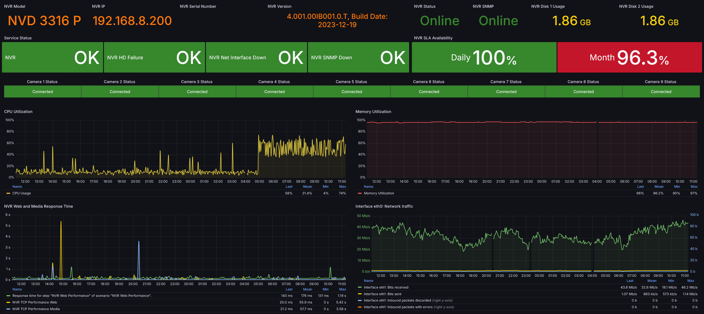

# Zabbix SNMP Template - NVR Intelbras / Dahua

  <a href="https://github.com/diasdmhub/Intelbras_NVR_Zabbix_Template/releases/tag/zabbix64">
    
  </>
  <a href="https://github.com/diasdmhub/Intelbras_NVR_Zabbix_Template/releases/tag/zabbix60">
    
  </>
  <a href="./LICENSE">
    
  </>

### OVERVIEW

Monitore dados SNMP do seu NVR Intelbras. \
*Monitor SNMP data from your Intelbras NVR.*

Funciona em modelos de NVR da **Intelbras** ou **Dahua**, entretanto, adaptações podem ser necessárias dependendo do dispositivo. \
*Works on different NVR models from **Intelbras** or **Dahua**, although, adaptations might be required.*

Disponível para o **Zabbix 5.4 ou maior**. Novas versões do Zabbix podem ter alterações. \
*Available for Zabbix 5.4 or higher. New Zabbix versions might have changes.*

 

### TESTED VERSION

Esta template foi testada somente com os NVRs Intelbras "NVD 3116 P" e "NVD 3316 P". Também Deve funcionar em outros de NVRs Intelbras ou Dahua. \
_This template was tested on Intelbras NVR "NVD 3116 P" and "NVD 3316 P". It should work with other Intelbras or Dahua NVRs as well._

 

**Observações são bem-vindas.** \
_**Feedbacks are welcome.**_

 

---
### ➡️ [Download (releases)](https://github.com/diasdmhub/Intelbras_NVR_Zabbix_Template/releases)
---
#### ➡️ [*Como importar templates/How to import templates.*](https://www.zabbix.com/documentation/current/en/manual/xml_export_import/templates#importing)
---
 

<!--

-->

### MACROS USED
<table>
    <tr>
	<th><b>Name</b></th>
	<th><b>Default</b></th>
    </tr>
    <tr>
        <td>{$API_PASS}</td>
	<td></td>
    </tr>
    <tr>
        <td>{$API_USER}</td>
	<td>admin</td>
    </tr>
    <tr>
        <td>{$DISK_FREE_WARN}</td>
	<td>0</td>
    </tr>
    <tr>
        <td>{$MEDIA_PORT}</td>
        <td>37777</td>
    </tr>
    <tr>
        <td>{$SNMP.TIMEOUT}</td>
        <td>5m</td>
    </tr>
    <tr>
        <td>{$WEB_PORT}</td>
	<td>80</td>
    </tr>
    <tr>
        <td>{$WEB_SERVICE}</td>
        <td>http</td>
    </tr>
    <tr>
	<td><i>Network Interface macros</i></td>
	<td></td>
    </tr>
</table>

> **Essas macros devem ser alteradas a nível de Host para refletir as portas de seu host monitorado.** \
> _**These macros should be changed at Host level to reflect your monitored host ports.**_
 

### TEMPLATE LINKS
<table>
  <tr>
        <td><del><a href="https://www.zabbix.com/integrations/snmp#interfaces_simple_snmp">Interfaces Simple SNMP</a> <i>(Network interfaces discovery)</i></del></td>
  </tr>
  <tr>
	<td><i><b>Não mais suportada</b> - Itens e Macros ainda estão presentes</i></td>
  </tr>
  <tr>
	<td><i><b>Not supported anymore</b> - Items and Macros are still present</i></td>
  </tr>
</table>
 

### ITEMS
<table>
  <tr>
        <td>CPU Usage</td>
  </tr>
  <tr>
        <td>Device IP</td>
  </tr>
  <tr>
        <td>Device Serial Number</td>
  </tr>
  <tr>
        <td>Device Status</td>
  </tr>
  <tr>
        <td>Device System Version</td>
  </tr>
  <tr>
        <td>Device Type</td>
  </tr>
  <tr>
        <td>Memory Utilization</td>
  </tr>
  <tr>
        <td>NVR Performance Media</td>
  </tr>
  <tr>
        <td>NVR Performance Web</td>
  </tr>
  <tr>
        <td>SNMP agent availability</td>
  </tr>
  <tr>
        <td>SNMP traps (fallback)</td>
  </tr>
  <tr>
        <td>System contact details</td>
  </tr>
  <tr>
        <td>System description</td>
  </tr>
  <tr>
        <td>System location</td>
  </tr>
  <tr>
        <td>System name</td>
  </tr>
  <tr>
        <td>System object ID</td>
  </tr>
  <tr>
        <td>System Status</td>
  </tr>
  <tr>
        <td>System Time</td>
  </tr>
  <tr>
        <td>Uptime Enterprise</td>
  </tr>
</table>
 

### TRIGGERS
<table>
  <tr>
        <td>CPU High Utilization</td>
  </tr>
  <tr>
        <td>Device IP changed</td>
  </tr>
  <tr>
        <td>Device Status Changed</td>
  </tr>
  <tr>
        <td>Device System Version changed</td>
  </tr>
  <tr>
        <td>Memory High Utilization</td>
  </tr>
  <tr>
        <td>No SNMP data collection</td>
  </tr>
  <tr>
        <td>System has been restarted (uptime < 10m) - <i>Depends on: No SNMP data collection</i></td>
  </tr>
  <tr>
        <td>System name has changed</td>
  </tr>
  <tr>
        <td>System Status Offline</td>
  </tr>
</table>
 

### DISCOVERY RULES
<table>
    <tr>
        <td>Camera Discovery <i>(items, trigger)</i></td>
    </tr>
    <tr>
	<td>Disk Discovery <i>(items, trigger, graph)</i></td>
    </tr>
    <tr>
	<td>Network interfaces discovery <i>(items, trigger, graph)</i></td>
    </tr>
</table>
 

### ITEM PROTOTYPES
<table>
  <tr>
        <td>Camera IP</td>
  </tr>
  <tr>
        <td>Camera Name</td>
  </tr>
  <tr>
        <td>Camera Status</td>
  </tr>
  <tr>
        <td>Disk Name</td>
  </tr>
  <tr>
        <td>Disk Percent Free</td>
  </tr>
  <tr>
        <td>Disk Size</td>
  </tr>
  <tr>
        <td>Disk Status</td>
  </tr>
  <tr>
        <td>Disk Used</td>
  </tr>
  <tr>
	<td>Interface: Bits received</td>
  </tr>
  <tr>
	<td>Interface: Bits sent</td>
  </tr>
  <tr>
	<td>Interface: Inbound packets discarded</td>
  </tr>
  <tr>
	<td>Interface: Inbound packets with errors</td>
  </tr>
  <tr>
	<td>Interface: Interface type</td>
  </tr>
  <tr>
	<td>Interface: Operational status</td>
  </tr>
  <tr>
	<td>Interface: Outbound packets discarded</td>
  </tr>
  <tr>
	<td>Interface: Outbound packets with errors</td>
  </tr>
  <tr>
	<td>Interface: Speed</td>
  </tr>
</table>
 

### TRIGGER PROTOTYPES
<table>
  <tr>
        <td>Camera disconnected</td>
  </tr>
  <tr>
        <td>Camera absent</td>
  </tr>
  <tr>
        <td>Disk ERROR</td>
  </tr>
  <tr>
        <td>Disk free space is low</td>
  </tr>
  <tr>
        <td>Interface: Ethernet has changed to lower speed than it was before</td>
  </tr>
  <tr>
        <td>Interface: High bandwidth usage</td>
  </tr>
  <tr>
        <td>Interface: High error rate</td>
  </tr>
  <tr>
        <td>Interface: Link down</td>
  </tr>
</table>
 

### GRAPHS
<table>
  <tr>
        <td>CPU Utilization</td>
  </tr>
  <tr>
        <td>Disk Usage <i>(discovery)</i></td>
  </tr>
  <tr>
        <td>Interface: Network traffic <i>(discovery)</i></td>
  </tr>
  <tr>
        <td>Memory Utilization</td>
  </tr>
  <tr>
        <td>NVR Response Time</td>
  </tr>
</table>
 

### DASHBOARDS
<table>
	<tr>
        <td>NVR Dashboard</td>
  </tr>
</table>
 

### WEB SCENARIOS
<table>
  <tr>
        <td>NVR Web Performance</td>
  </tr>
</table>
 

### DASHBOARD EXAMPLE

---

---

