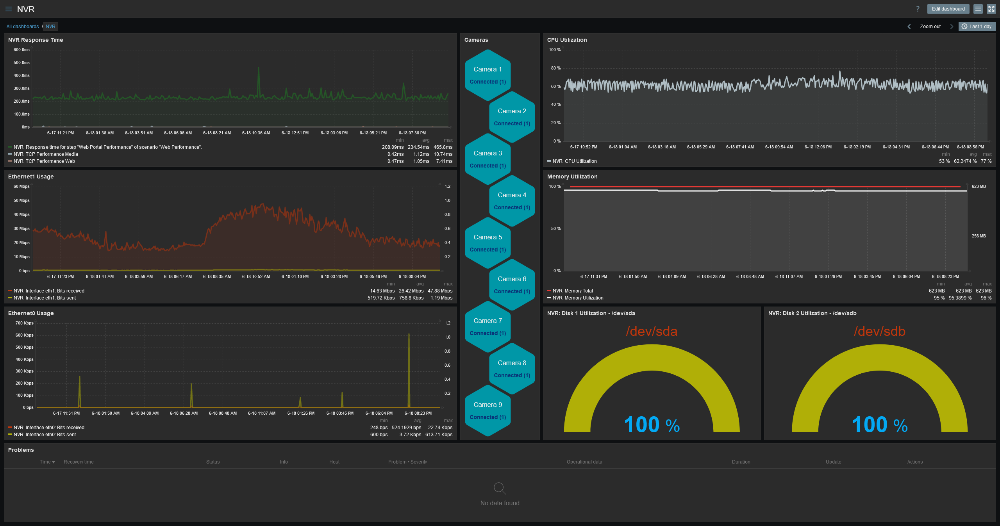

# Zabbix SNMP Template - NVR Intelbras / Dahua

    
    
    

 

### OVERVIEW

Monitore dados SNMP do seu NVR Intelbras ou Dahua. \
*Monitor SNMP data from your Intelbras or Dahua NVR.*

Funciona em modelos de NVR da **Intelbras** ou **Dahua**, entretanto, adaptações podem ser necessárias dependendo do dispositivo. \
*Works on **Intelbras** or **Dahua** NVR models, although customization might be required depending on the device.*

Versões antigas disponíveis no diretório [Template](./Template). \
*Older versions available in the [Template](./Template) directory.*

 

### TESTED VERSION

Esta template foi testada somente com os NVRs Intelbras "NVD 3116 P" e "NVD 3316 P". Também deve funcionar em outros NVRs Intelbras ou Dahua. \
_This template was tested on Intelbras NVR "NVD 3116 P" and "NVD 3316 P". It should also work with other Intelbras or Dahua NVRs as well._

 

**Observações são bem-vindas.** \
_**Feedbacks are welcome.**_

 

---
### ➡️ [Download (releases)](https://github.com/diasdmhub/Intelbras_NVR_Zabbix_Template/releases)
---
#### ➡️ [*Como importar templates/How to import templates.*](https://www.zabbix.com/documentation/current/en/manual/xml_export_import/templates#importing)
---

 

<!--

-->

### MACROS USED

<table>
    <tr>
        <th><b>Name</b></th>
        <th><b>Default value</b></th>
        <th><b>Description</b></th>
    </tr>
    <tr>
        <td>{$API_PASS}</td>
        <td></td>
        <td>Set your API password if used</td>
    </tr>
    <tr>
        <td>{$API_USER}</td>
        <td>admin</td>
        <td>Set your API user if used</td>
    </tr>
    <tr>
        <td>{$DISK_FREE_WARN}</td>
        <td>100</td>
        <td>Disk free percentage threshold. Set to 100 if the disk stays full</td>
    </tr>
    <tr>
        <td>{$MEDIA_PORT}</td>
        <td>37777</td>
        <td>Media port for image access</td>
    </tr>
    <tr>
        <td>{$SNMP.TIMEOUT}</td>
        <td>5m</td>
        <td>SNMP availability timeout threshold</td>
    </tr>
    <tr>
        <td>{$WEB_PORT}</td>
        <td>80</td>
        <td>HTTP port for WEB UI access</td>
    </tr>
    <tr>
        <td>{$WEB_SERVICE}</td>
        <td>http</td>
        <td>Set your Web service (http or https)</td>
    </tr>
    <tr>
        <td><i>Network Interface macros</i></td>
        <td></td>
        <td><i>For interface discovery</i></td>
    </tr>
</table>

> **Essas macros devem ser alteradas a nível de Host para refletir as configurações de seu host monitorado.** \
> _**These macros should be changed at the Host level to reflect your monitored host configuration.**_

 

### ITEMS

<table>
    <tr>
        <td>CPU Utilization</td>
    </tr>
    <tr>
        <td>Device Channel Number</td>
    </tr>
    <tr>
        <td>Device contact details</td>
    </tr>
    <tr>
        <td>Device description</td>
    </tr>
    <tr>
        <td>Device IP</td>
    </tr>
    <tr>
        <td>Device location</td>
    </tr>
    <tr>
        <td>Device name</td>
    </tr>
    <tr>
        <td>Device Serial Number</td>
    </tr>
    <tr>
        <td>Device Status</td>
    </tr>
    <tr>
        <td>Device System Version</td>
    </tr>
    <tr>
        <td>Device Type</td>
    </tr>
    <tr>
        <td>Device Walk Network</td>
    </tr>
    <tr>
        <td>Device Walk Remote Cam</td>
    </tr>
    <tr>
        <td>Device Walk Storage</td>
    </tr>
    <tr>
        <td>Device Walk System General</td>
    </tr>
    <tr>
        <td>Device Walk System Info</td>
    </tr>
    <tr>
        <td>Memory Total</td>
    </tr>
    <tr>
        <td>Memory Utilization</td>
    </tr>
    <tr>
        <td>TCP Performance Media</td>
    </tr>
    <tr>
        <td>TCP Performance Web</td>
    </tr>
    <tr>
        <td>SNMP Agent Availability</td>
    </tr>
    <tr>
        <td>SNMP Traps Fallback</td>
    </tr>
    <tr>
        <td>System OS Name</td>
    </tr>
    <tr>
        <td>System OS Version</td>
    </tr>
    <tr>
        <td>System Status</td>
    </tr>
    <tr>
        <td>System Time</td>
    </tr>
    <tr>
        <td>Uptime Enterprise</td>
    </tr>
</table>

 

### TRIGGERS

<table>
    <tr>
        <td>CPU High Utilization</td>
    </tr>
    <tr>
        <td>Device IP changed</td>
    </tr>
    <tr>
        <td>Device Status Changed to Bad</td>
    </tr>
    <tr>
        <td>Device System Version changed</td>
    </tr>
    <tr>
        <td>Memory High Utilization</td>
    </tr>
    <tr>
        <td>No SNMP data collection</td>
    </tr>
    <tr>
        <td>System has been restarted (uptime < 10m)</td>
    </tr>
    <tr>
        <td>System name has changed</td>
    </tr>
    <tr>
        <td>System Status Offline</td>
    </tr>
    <tr>
        <td>Unresponsive Media Port</td>
    </tr>
    <tr>
        <td>Unresponsive Web Port</td>
    </tr>
</table>

 

### DISCOVERY RULES

<table>
    <tr>
        <td>Camera Discovery <i>(items, trigger)</i></td>
    </tr>
    <tr>
        <td>Disk Discovery <i>(items, trigger, graph)</i></td>
    </tr>
    <tr>
        <td>Network interfaces discovery <i>(items, trigger, graph)</i></td>
    </tr>
</table>

 

### ITEM PROTOTYPES

<table>
    <tr>
        <td>Camera IP</td>
    </tr>
    <tr>
        <td>Camera Name</td>
    </tr>
    <tr>
        <td>Camera Status</td>
    </tr>
    <tr>
        <td>Disk Name</td>
    </tr>
    <tr>
        <td>Disk Size</td>
    </tr>
    <tr>
        <td>Disk Status</td>
    </tr>
    <tr>
        <td>Disk Usage</td>
    </tr>
    <tr>
        <td>Disk Utilization</td>
    </tr>
    <tr>
        <td>Interface Admin status</td>
    </tr>
    <tr>
        <td>Interface Bits received</td>
    </tr>
    <tr>
        <td>Interface Bits sent</td>
    </tr>
    <tr>
        <td>Interface Inbound packets discarded</td>
    </tr>
    <tr>
        <td>Interface Inbound packets with errors</td>
    </tr>
    <tr>
        <td>Interface Operational status</td>
    </tr>
    <tr>
        <td>Interface Outbound packets discarded</td>
    </tr>
    <tr>
        <td>Interface Outbound packets with errors</td>
    </tr>
    <tr>
        <td>Interface Speed</td>
    </tr>
    <tr>
        <td>Interface Type</td>
    </tr>
</table>

 

### TRIGGER PROTOTYPES

<table>
    <tr>
        <td>Camera absent</td>
    </tr>
    <tr>
        <td>Camera disconnected</td>
    </tr>
    <tr>
        <td>Disk Error</td>
    </tr>
    <tr>
        <td>Disk Utilization is High</td>
    </tr>
    <tr>
        <td>Interface: Ethernet has changed to lower speed than it was before</td>
    </tr>
    <tr>
        <td>Interface: High bandwidth usage</td>
    </tr>
    <tr>
        <td>Interface: High error rate</td>
    </tr>
    <tr>
        <td>Interface: Link down</td>
    </tr>
</table>

 

### GRAPHS

<table>
    <tr>
        <td>CPU Utilization</td>
    </tr>
    <tr>
        <td>Memory Utilization</td>
    </tr>
    <tr>
        <td>NVR Response Time</td>
    </tr>
    <tr>
        <td>Disk Usage <i>(discovery)</i></td>
    </tr>
    <tr>
        <td>Interface: Network traffic <i>(discovery)</i></td>
    </tr>
</table>

 

### DASHBOARDS

<table>
    <tr>
        <td>NVR Dashboard</td>
    </tr>
</table>

 

### WEB SCENARIOS

<table>
    <tr>
        <td>NVR Web Performance</td>
    </tr>
</table>

 

### DASHBOARD EXAMPLE

---

---

